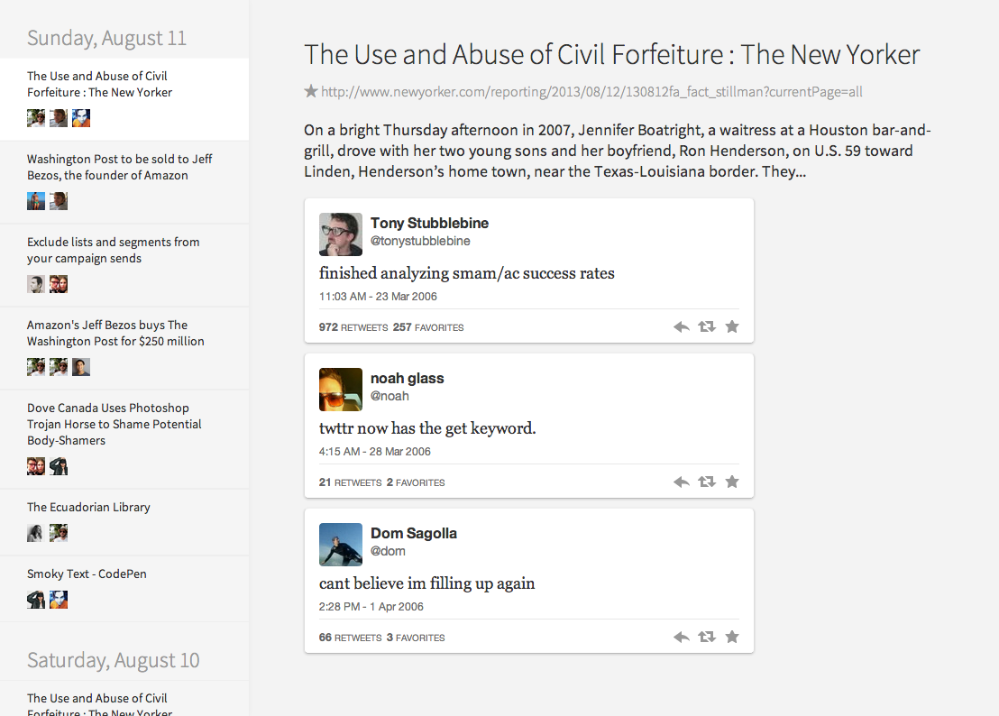

# signoff.io

Turn your twitter feed into a link feed.

## Status

Just the start of the design and front-end at the moment.

## Developing

Install the dependencies:

    npm install

Build the files:

    make

Serve up public on port 8080:

    make server

Watch files and recompile:

    make watch
